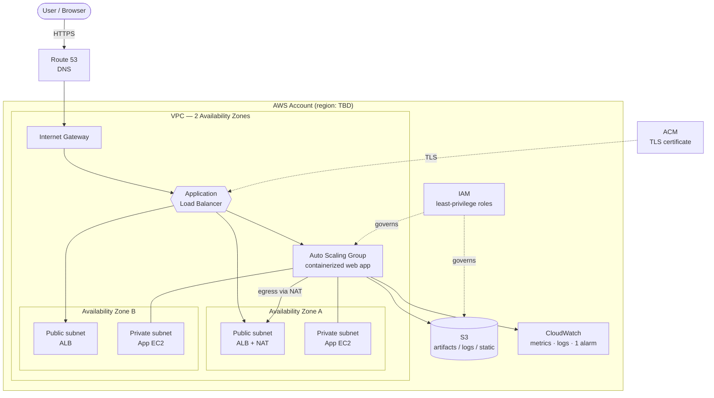

# Month 1 — AWS Foundation Architecture

Starter architecture for the Month 1 goal: *a secure AWS foundation for a small
production-style application.* This is a design target for Weeks 1–4 — adjust it as
you build and record any deviations in an ADR under `docs/architecture-decisions/`.

## Diagram

## Component notes

| Component | Purpose | Week introduced |
|---|---|---|
| Route 53 + ACM | DNS and TLS termination (or documented lab alternative) | 3 |
| VPC / subnets / IGW / NAT | Network isolation across 2 AZs; controlled egress | 2 |
| Security groups | Least-required ports for ALB / app / admin | 2 |
| ALB | Public entry point; direct app access restricted | 3 |
| Auto Scaling Group | Self-healing, repeatable instance bootstrap | 3 |
| S3 | Artifacts, log archive, or static assets (encrypted) | 4 |
| CloudWatch | Metrics, logs, and at least one alarm | 4 |
| IAM | Short-lived / least-privilege access | 1 |

## Expected cost — create/destroy model

**Operating model:** resources are **created for a lab session and destroyed after**,
so there is no always-on infrastructure. Effective monthly cost is therefore **~$0**,
provided teardown is verified every session.

Cost is better expressed **per running hour** than per month, since nothing runs idle:

| Item | Billed while running? | Notes |
|---|---|---|
| EC2 (app instances) | Yes, per hour | Stop/terminate at end of session |
| Application Load Balancer | Yes, per hour + LCUs | Delete after session — common orphan |
| NAT Gateway | Yes, per hour + data | Charges immediately; delete promptly |
| Elastic IP | Yes, when allocated/idle | Release after teardown |
| EBS volumes / snapshots | Yes, while they exist | Delete with the instances |
| S3 | Storage + requests | Tiny; safe to leave or empty the bucket |
| Route 53 | Per hosted zone / month | Small standing cost if a zone is kept |
| CloudWatch | Metrics/logs | Negligible for a small lab |

> **Not truly $0:** NAT/EIP/EBS bill the moment they exist, and forgotten resources
> (orphaned ALB/NAT) are the usual surprise bill. The `DevOps Bill` budget alerts at
> **>$0.01**, so any real spend triggers an email immediately.
>
> **Teardown discipline:** after each session, verify no chargeable resources remain
> (see the teardown runbook under `docs/runbooks/`). Fill in real per-hour figures for
> your region if you want a concrete session-cost estimate.
